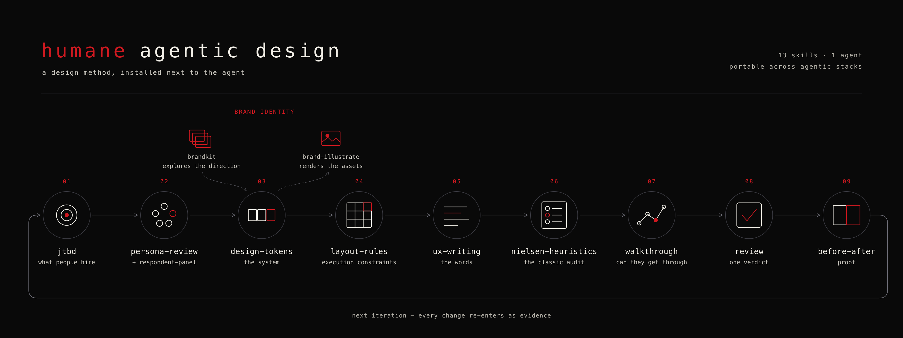

# Humane Agentic Design

**[humane.salient.community](https://humane.salient.community/)** — method, install instructions, and the live cohort.



> Taught live at the **[Agentic Design Lab](https://ai-design.salient.community/)** — a 5-week cohort where designers, PMs, and founders build real products with agents using exactly this method.

Agent-produced interface slop is a method problem, not a model problem. A capable model still ships generic UI when it jumps straight to pixels with no idea who it is building for or under which constraints. The fix is the method, installed next to the agent: what to build, for whom, under which constraints, then proof it got better. This plugin packages that method as a cycle, for people and for the agents working alongside them.

## The cycle

Run the steps in order for a new project, or reach for any one on its own. Each skill knows its place in the method — and refuses the jobs owned by its neighbors.

| # | Skill | What it does |
|---|-------|--------------|
| 0 | `setup` | Resolves config and checks every dependency; installs what you confirm, never touches API keys. |
| 1 | `jtbd` | Jobs-to-Be-Done interview, one question at a time; ODI opportunity scoring; produces `jtbd.json`, the corpus every later step reads. |
| 2 | `prototype` | Names the **one open question**, then answers it at the lowest rung that can: ASCII → SVG click-dummy → self-contained HTML. |
| 3 | `persona-review` + `respondent-panel` | Expert critique of documents; gut reactions from synthetic strangers in isolated contexts. Honest about being a rehearsal, not market research. |
| 4 | `design-tokens` | DTCG token set → compiled CSS + `DESIGN.md`, with executable APCA/WCAG contrast checking (`tokens contrast`). |
| 4b | `type-specimen` | Sets every shortlisted typeface in **your product's own copy** on one page, so the family enters tokens having already done the job. |
| 5 | `layout-rules` | An avoid-list of 39 defect classes for tool/dashboard UIs, each one caught in a real build. The single highest-leverage skill for stopping agent slop. |
| 6 | `ux-writing` | Interface copy grounded in the corpus: the anxiety force shapes the confirmation, the quotes supply the vocabulary. |
| 7 | `nielsen-heuristics` | The formal usability inspection — per-heuristic probes, severity scale, mandatory evidence locator. |
| 8 | `walkthrough` | Attempts one corpus job step by step as the person who has it, including empty, error, and interrupted paths. Any "no" is a break. |
| 9 | `review` | One orchestrator, one verdict (`Block` / `Needs changes` / `Approve`). Marks a domain *Not reviewed* rather than improvising rules it doesn't own. |
| 10 | `before-after` | The felt shift, first person: "I check my dashboard with dread" → "I glance at costs once a week, casually." Proof, or a reason to question the change. |

**Ring 2 — brand identity.** `brandkit` explores a brand that doesn't exist yet and hands the winning direction into the token set's brand block; `brand-illustrate` generates asset batches under an existing token contract, shelling out to whichever image backend is installed (`gpt-image-2`, `nano-banana`).

**Adapter layer — `design-frameworks`.** Fits a settled prototype or existing implementation to a real design system: probes the system's native machine surfaces, produces a fit plan, previews every framework-owned write, and reports framework compliance separately from Humane traceability. Astryx is the first full preset; shadcn and Storybook cover registry and project-catalog surfaces. This is not step 11 — it is an implementation adapter between prototype and review.

## Install

### Claude Code

```
/plugin marketplace add glebis/humane-agentic-design
/plugin install humane@humane-agentic-design
```

### Any other agent (Codex, and others)

```
npx skills add glebis/humane-agentic-design
```

The installer is interactive — pick scope (`Project` or `Global`) and method (`Symlink` keeps one source of truth). Skills land in `.agents/skills/<name>/`, with each agent's own directory symlinked to them. Or skip the installer: point your agent at this repo's `humane/skills/` directory.

## How to use it

Start a new product idea and let the cycle carry it end to end: capture the job (`jtbd`, with the ODI pass), sketch at the lowest rung that can answer the open question (`prototype`), pressure-test (`persona-review`, then `respondent-panel`), set the system (`design-tokens` — settle the typeface first with `type-specimen` if it's still open), build under constraints (`design-frameworks` if a design system already exists, then `layout-rules` as hard rules), write the words (`ux-writing`), audit (`nielsen-heuristics`), walk the unhappy paths (`walkthrough`), get one verdict (`review`), prove it (`before-after`) — and feed what you learned back into step 1.

Two commands ship with `jtbd` for looking at the corpus:

```
python3 <plugin>/skills/jtbd/scripts/graph.py            # interactive corpus viewer (11 views)
python3 <plugin>/skills/jtbd/scripts/report.py exec-summary <slug>   # one-page stakeholder summary
```

## Learn the method live

Reading a method is not the same as running one. The full cycle is taught hands-on at the **[Agentic Design Lab](https://ai-design.salient.community/)** — current cohort dates and syllabus on the site.

## Works with any agent

The core skills carry no absolute paths and no Claude-only tool imperatives, and their scripts use only the Python standard library. Genuinely Claude Code specific pieces (the Linear CLI for task export, the `synthetic-respondent` agent format) are called out under a "Claude Code extras" note and degrade gracefully elsewhere.

## Humane, interfaces, and Impeccable

- **Humane** — the method *before* code: what to build, for whom, under which constraints, in which words.
- **[interfaces](https://github.com/jakubkrehel/skills)** — craft *in* the code: typography mechanics, OKLCH palettes, accessibility engineering, motion.
- **Impeccable** — quality *after*: audit, normalize, polish, harden.

Humane's reviews mark a domain *Not reviewed* and name the missing plugin rather than improvising rules they don't own — so installing the others makes the reviews genuinely broader, not just louder.

## Roadmap

Planned next: `dataviz` — chart constraints, the `layout-rules` of data.

## License

MIT © Gleb Kalinin