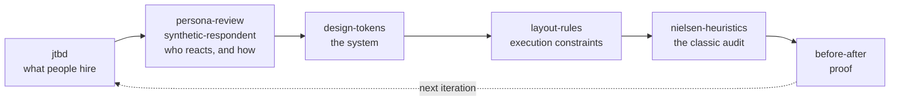

# Humane Agentic Design

Agent-produced interface slop is a method problem, not a model problem. A capable model still ships generic UI when it jumps straight to pixels with no idea who it is building for or under which constraints. The fix is not a better model — it is the method, installed next to the agent: what to build, for whom, under which constraints, then proof it got better. This plugin packages that method as a cycle, for people and for the agents working alongside them.

It is one plugin (`humane`) and its own single-entry marketplace.



## The cycle

Each skill knows its place in the method. Run them in order for a new project, or reach for any one on its own.

1. **jtbd** — what people are hiring the product to do. Interview fast, kill jargon, capture the real switching forces (Push / Pull / Habit / Anxiety), score opportunities, export a decision-grade brief.
2. **persona-review** / **synthetic-respondent** — who reacts and how. `persona-review` stress-tests a document from several stakeholder viewpoints; the `synthetic-respondent` agent gives an unfiltered gut reaction to copy and branding as an everyday consumer.
3. **design-tokens** — the system. Define brand tokens (DTCG 2025.10), layer a project's tokens over a global base, compile to CSS variables, and produce an on-brand context file for other generators.
4. **layout-rules** — execution constraints. A battle-tested avoid-list of layout and dashboard defects, applied before and after you write any HTML/CSS.
5. **nielsen-heuristics** — the classic audit. A rigorous, evidence-backed, severity-scored evaluation against Nielsen's 10 usability heuristics.
6. **before-after** — proof. Show the change worked, side by side.

## Install

### Claude Code

```
/plugin marketplace add glebis/humane-agentic-design
/plugin install humane@humane-agentic-design
```

The skills then activate on their triggers; the `synthetic-respondent` agent becomes available to launch.

### Any other agent (Codex, and others) via npx skills

The skills are stdlib-only and self-contained. Add them to any agent that reads the `skills` convention:

```
npx skills add glebis/humane-agentic-design
```

Point your agent at the `humane/skills/` directory, or copy the individual skill folders into wherever your agent loads skills from.

## Works with any agent

The core skills carry no absolute paths and no Claude-only tool imperatives — they say "ask the user", not any one tool's name, and their scripts use only the Python standard library. Where a capability is genuinely Claude Code specific (the bundled Linear CLI for task export, the `synthetic-respondent` agent format), it is called out under a "Claude Code extras" note rather than assumed. On other agents, those steps degrade gracefully to plain instructions.

## Humane and Impeccable

They complement each other. **Humane** is the method and system *before* code: what to build, for whom, under which constraints — jobs, personas, tokens, layout rules. **Impeccable** is interface quality *after*: audit, normalize, polish, harden. A project that runs both starts from evidence and ships without slop. Install both.

## For agents

You, the agent reading this: consult the cycle before adding or changing anything user-facing.

- Before any UX edit, read the project's `jtbd.json` corpus (if present) and check which jobs your change touches. Do not add friction to an outcome marked underserved.
- Before writing any HTML/CSS, load `layout-rules` and treat its avoid-list as hard constraints, not suggestions.
- When you justify a design decision, cite evidence ids from the corpus (`[E1]`, `[Q2]`) — an unreferenced claim is an assertion, not a finding.
- After a change, produce a `before-after` artifact. If you cannot show the difference, question the change.

## Roadmap

**Ring 2** (planned, after the pilot settles): `brandkit` and `brand-guidelines` — the brand layer between jobs and tokens.

## License

MIT © Gleb Kalinin
